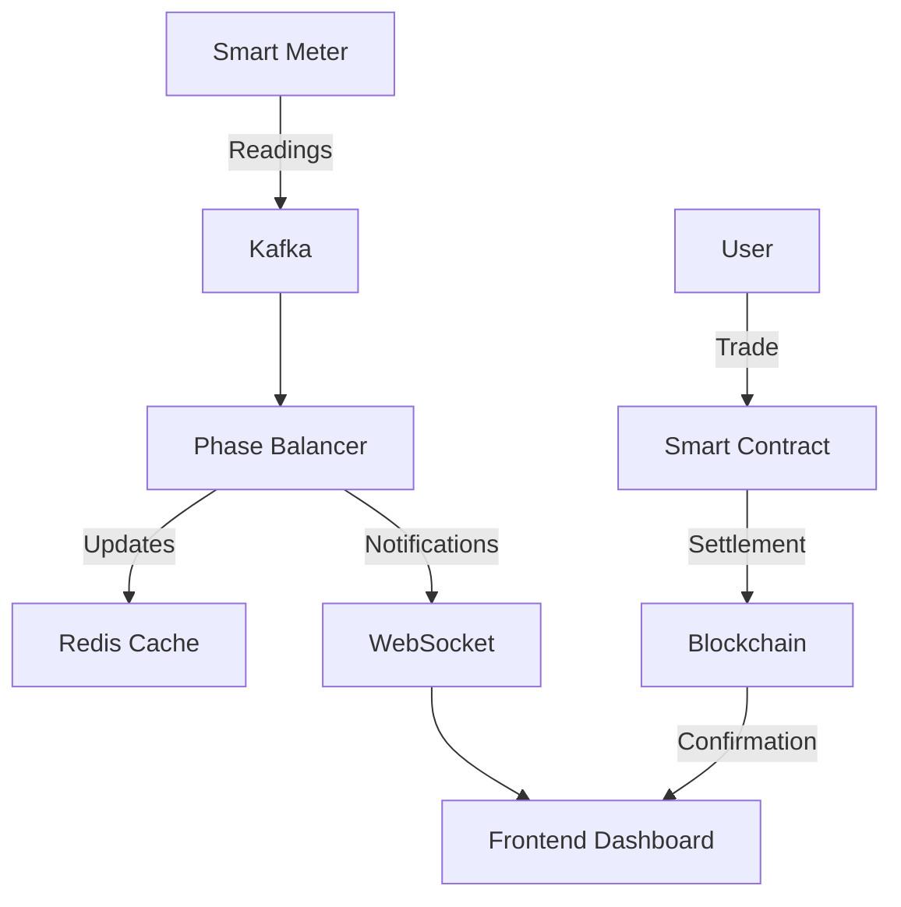

# P2P Energy Trading Platform

## Overview

This project is a comprehensive decentralized energy trading platform that enables peer-to-peer energy transactions using blockchain technology. It combines a React frontend, Go backend for phase balancing, and Ethereum smart contracts to create a seamless energy trading ecosystem.

## System Flow

1. **User Registration & Authentication**
   - User creates an account
   - Connects MetaMask wallet
   - Completes KYC verification

2. **Energy Production & Monitoring**
   - Smart meters record energy production
   - Data sent to Phase Balancer via Kafka
   - Real-time monitoring through WebSocket

3. **Phase Balancing**
   - Go backend processes meter readings
   - Calculates optimal phase distribution
   - Updates phase assignments in Redis
   - Notifies frontend via WebSocket

4. **Energy Trading**
   - Producer lists excess energy
   - Energy tokens minted (ERC20)
   - Consumers browse available energy
   - Smart contract handles P2P trading
   - USDT used for settlements

5. **Transaction Settlement**
   - Smart contract verifies balance
   - Executes token transfer
   - Updates energy allocation
   - Records transaction on blockchain

6. **Monitoring & Reporting**
   - Dashboard shows real-time metrics
   - Energy consumption patterns
   - Trading history
   - Phase balance status



## Key Features

- 🔐 **Secure Authentication**: User authentication and authorization system
- 💡 **Energy Trading**: P2P energy token trading with USDT payments
- ⚡ **Phase Balancing**: Real-time power grid phase balancing
- 📊 **Dashboard**: Live monitoring of energy usage and transactions
- 🔄 **Smart Contracts**: ERC20 tokens for energy trading
- 📱 **Responsive UI**: Modern, mobile-friendly interface

## Architecture

```
├── clientt/                  # React frontend application
├── contracts/               # Smart contracts
├── my-foundry-project/     # Ethereum development environment
├── phase-balancer/         # Go backend for phase management
└── server/                 # Node.js backend server
```

## Technology Stack

- **Frontend**: React, Vite, TailwindCSS
- **Backend**: Node.js, Go
- **Blockchain**: Ethereum, Solidity, Foundry
- **Message Queue**: Apache Kafka
- **Cache**: Redis
- **WebSocket**: Real-time updates

## Prerequisites

- Node.js (v16+)
- Go (v1.19+)
- Redis Server
- Apache Kafka
- Foundry
- MetaMask wallet

## Installation

1. **Clone the repository**
   ```bash
   git clone https://github.com/yourusername/p2p-energy-trading.git
   cd p2p-energy-trading
   ```

2. **Frontend Setup**
   ```bash
   cd clientt
   npm install
   cp .env.example .env
   ```

3. **Server Setup**
   ```bash
   cd server
   npm install
   cp .env.example .env
   ```

4. **Phase Balancer Setup**
   ```bash
   cd phase-balancer
   go mod tidy
   ```

5. **Smart Contract Setup**
   ```bash
   cd my-foundry-project
   forge install
   ```

## Configuration

### Environment Variables

1. **Server (.env)**
   ```env
   BLOCKCHAIN_RPC_URL=<your_rpc_url>
   PRIVATE_KEY=<your_private_key>
   ENERGY_TOKEN_ADDRESS=<energy_token_contract_address>
   USDT_TOKEN_ADDRESS=<usdt_token_contract_address>
   ```

2. **Client (.env)**
   ```env
   VITE_API_URL=http://localhost:3000
   VITE_WS_URL=ws://localhost:8080
   ```

## Running the Application

1. **Start Redis**
   ```bash
   redis-server
   ```

2. **Start Kafka**
   ```bash
   # Start Zookeeper
   bin/zookeeper-server-start.sh config/zookeeper.properties
   
   # Start Kafka Server
   bin/kafka-server-start.sh config/server.properties
   ```

3. **Start Frontend**
   ```bash
   cd clientt
   npm run dev
   ```

4. **Start Backend Server**
   ```bash
   cd server
   npm start
   ```

5. **Start Phase Balancer**
   ```bash
   cd phase-balancer
   go run main.go
   ```

## Testing

1. **Smart Contracts**
   ```bash
   cd my-foundry-project
   forge test
   ```

2. **Frontend**
   ```bash
   cd clientt
   npm test
   ```

3. **Backend**
   ```bash
   cd server
   npm test
   ```

## API Documentation

- Frontend: http://localhost:5173
- Backend API: http://localhost:3000
- WebSocket: ws://localhost:8080

## Contributing

1. Fork the repository
2. Create your feature branch (`git checkout -b feature/amazing-feature`)
3. Commit your changes (`git commit -m 'Add some amazing feature'`)
4. Push to the branch (`git push origin feature/amazing-feature`)
5. Open a Pull Request

## License

This project is licensed under the MIT License - see the [LICENSE.md](LICENSE.md) file for details.

## Acknowledgments

- [Vite](https://vitejs.dev/)
- [Foundry](https://book.getfoundry.sh/)
- [Ethers.js](https://docs.ethers.io/v5/)
- [React](https://reactjs.org/)

## Support

For support, please open an issue in the repository.